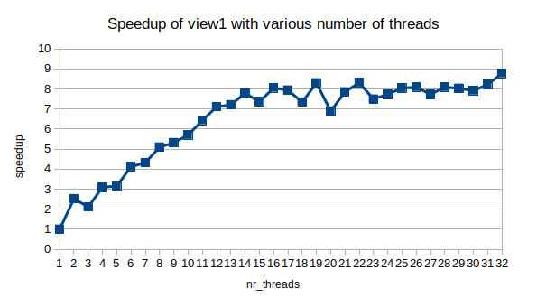
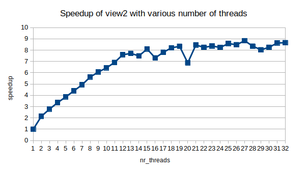
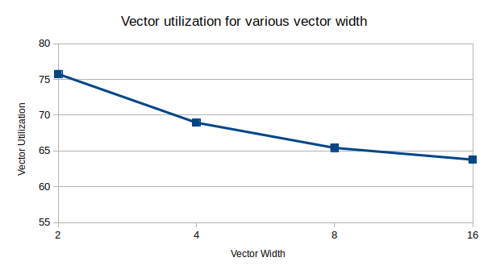

## Program #1: Parallel Fractal Generation Using Pthread

### Intel HT

TODO

### Solutions

> In your writeup, describe your approach and report the final 4-thread speedup obtained.

对于结果 mandelbrot-thread.ppm，若干连续的行形成一个 tile，每个 thread 负责生成一个 title。结果，4 threads 时，view1 和 view2 分别可获得 3.1x 和 3.35x 的加速比。

> Is speedup linear in the number of cores used? In your writeup hypothesize why this is (or is not) the case? (you may also wish to produce a graph for VIEW 2 to help you come up with an answer.)

Machine: Intel Core i7-6700 CPU with hyper-thread on => 8 logical cores





由图，线程数小于 12 时，speedup 随线程数线性增长。当线程数大于 12 时，speedup 趋于 8，即趋于 CPU 的核心数。

## Program #2: Vectorizing Code Using SIMD Intrinsics

### Available operations in CMU418intrin.h

```c++
// Types
__cmu418_vec_float
__cmu418_vec_int
__cmu418_mask
// Mask operations
// Return: __cmu418_mask
_cmu418_init_ones	// 前 first 个 bit 置 1，其它置 0
_cmu418_mask_not	// ~maska
_cmu418_mask_or		// maska | maskb
_cmu418_mask_and	// maska & maskb
_cmu418_cntbits		// 统计 mask 中 1 的个数
// Vector operations
_cmu418_vset_float	// mask 为 1 的元素置指定 value
_cmu418_vset_int
_cmu418_vmove_float	// 移动 mask 为 1 的元素到目的 vector
_cmu418_vmove_int
_cmu418_vload_float	// 将指定数据加载到向量寄存器
_cmu418_vload_int
*_vstore_*
*_vadd_*			// vec_C = vec_A + vec_B
*_vsub_*
*_vmult_*
*_vdiv_*
*_vabs_*
*_vgt_*				// Return a mast of (vec_A > vec_B) if vector lane active
*_vlt_*
*_veq_*
*_hadd_*			// [0 1 2 3] -> [0+1 0+1 2+3 2+3] = [1 1 5 5]
*_interleave_*		// [0 1 2 3 4 5 6 7] -> [0 2 4 6 1 3 5 7]
```

### Vectorized abs() as a example

```c++
void absVector(float* values, float* output, int N) {
  __cmu418_vec_float x;
  __cmu418_vec_float result;
  __cmu418_vec_float zero = _cmu418_vset_float(0.f);
  __cmu418_mask maskAll, maskIsNegative, maskIsNotNegative;

//  Note: Take a careful look at this loop indexing.  This example
//  code is not guaranteed to work when (N % VECTOR_WIDTH) != 0.
//  Why is that the case?
  for (int i=0; i<N; i+=VECTOR_WIDTH) {

    // All ones
    maskAll = _cmu418_init_ones();

    // All zeros
    maskIsNegative = _cmu418_init_ones(0);

    // Load vector of values from contiguous memory addresses
    _cmu418_vload_float(x, values+i, maskAll);               // x = values[i];

    // Set mask according to predicate
    _cmu418_vlt_float(maskIsNegative, x, zero, maskAll);     // if (x < 0) {

    // Execute instruction using mask ("if" clause)
    _cmu418_vsub_float(result, zero, x, maskIsNegative);      //   output[i] = -x;

    // Inverse maskIsNegative to generate "else" mask
    maskIsNotNegative = _cmu418_mask_not(maskIsNegative);     // } else {

    // Execute instruction ("else" clause)
    _cmu418_vload_float(result, values+i, maskIsNotNegative); //   output[i] = x; }

    // Write results back to memory
    _cmu418_vstore_float(output+i, result, maskAll);
  }
}
```

如果 (N % VECTOR_WIDTH) != 0，则 input 的最后一部分不足以构成一个长为 VECTOR_WIDTH 的向量，此时后面所有的针对长为 VECTOR_WIDTH 的向量运算都会导致错误。解决方法如下

```c++
...
last_part_len = N % VECTOR_WIDTH;
for (int i=0; i<N-last_part_len; i+=VECTOR_WIDTH) {
	...
}
// Handle the last vector
if (last_part_len) {
	maskAll = _cmu418_init_ones(last_part_len);
	// Do the same as above
}
```

### Debugging for CMU418's fake vector instrinics

Use `./myexp -l` to print a log of executed vector instruction at the end.

### clampedExpSerial()

output[i] = values[i]^exponents[i] && clamp(output[i], 9.999999f)

### Algorithm for vectorized sum

```c++
float arraySumVector(float *valus, int N)
{
	// See code
	// hadd, interleave
}
```

### Solutions

> Does the vector utilization increase, decrease or stay the same as VECTOR_WIDTH changes? Why?

Metrics:

- Vector width
- Total vector instructions
- Vector utilization
- Utilized vector lanes
- Total vector lanes

`./myexp -s 10000` with VECTOR_WIDTH in [2, 4, 8, 16]



向量寄存器的利用率随着其长度递减。

## Program #3: Parallel Fractal Generation Using ISPC

###  ISPC

> It compiles a C-based SPMD programming languarge to run on the SIMD units (multiple cores / vector unit) of CPUs and the Intel Xeon Phi architecture. It currently supports the SSE2, SSE4, AVX1, AVX2, AVX512, and Xeon Phi instruction sets.

SIMD operations on Intel CPUs (C like API can [see intrinsics guide](https://software.intel.com/sites/landingpage/IntrinsicsGuide/))

- MMX -> SSE[1-4] -> AVX[1-2] -> AVX512
- MMX : 64bits (length of the register)
- SSE[1-4]: 128bits
- AVX[1-2]: 256bits
- AVX512: 512bits
- KNC: @Xeon Phi

### Error on compiling


通过 `--pic` 指定 ispc 编译生成 PIC 版 object 即可。

### Selecting the compiling target of ISPC-based program

由 [ISPC 此处文档](https://ispc.github.io/ispc.html#selecting-the-compilation-target)可知：

- --arch={x86, x86-64,arm}
- --cpu=
- --target=[ISA]-i[mask size]x[gang size] e.g. --target=avx2-i32-16

[ISPC 程序执行模型](https://ispc.github.io/ispc.html#basic-concepts-program-instances-and-gangs-of-program-instances)提出 gang 和 instance 的概念。instance 类似 CUDA PTX 中的 thread，gang 对应于 warp（即最小调度单元），由若干 instances 构成 gang。其大小由 SIMD 单元所用寄存器的大小决定。例如 SSE 使用 128bits 的寄存器，则对于长为 32bit 的 data，向量长度为 4（即 4-wide SSE vector），则 gang size 为 4 或 8。而对于 AVX（使用 256bits 的寄存器），向量长度为 8（即 8-wide AVX vecotr），gang size 可为 4 / 8 / 16。

### Solutions

>What is the maximum speedup you expect given what you know about these CPUs? Why might the number you observe be less than this ideal? (Hint: Consider the characteristics of the computation you are performing? Describe the parts of the image that present challenges for SIMD execution? Comparing the performance of rendering the different views of the Mandelbrot set may help confirm your hypothesis.)
>
>We remind you that for the code described in this subsection, the ISPC compiler maps gangs of program instances to SIMD instructions executed on a single core. This parallelization scheme differs from that of Program 1, where speedup was achieved by running threads on multiple cores.

mandelbrot 程序中涉及变量类型为 float 和 int，长为 32bit，故使用 128bit 寄存器的 SSE 可构成长为 4 的向量，而 AVX 可构成长为 8 的向量，其理论加速比分别为 4x 和 8x，实际为 3.3x（avx1-i32x4）和 6.37x（avx1-i32x8）。不同的 target 所带来的加速比各不相同，如下图。

图 TODO

```c++
static inline int mandel(float c_re, float c_im, int count) {
    float z_re = c_re, z_im = c_im;
    int i;
    for (i = 0; i < count; ++i) {

        if (z_re * z_re + z_im * z_im > 4.f)
           break;

        float new_re = z_re*z_re - z_im*z_im;
        float new_im = 2.f * z_re * z_im;
        z_re = c_re + new_re;
        z_im = c_im + new_im;
    }

    return i;
}

export void mandelbrot_ispc(uniform float x0, uniform float y0, 
                            uniform float x1, uniform float y1,
                            uniform int width, uniform int height, 
                            uniform int maxIterations,
                            uniform int output[])
{
    float dx = (x1 - x0) / width;
    float dy = (y1 - y0) / height;

    foreach (j = 0 ... height, i = 0 ... width) {
            float x = x0 + i * dx;
            float y = y0 + j * dy;

            int index = j * width + i;
            output[index] = mandel(x, y, maxIterations);
    }
}
```

由 mandel 函数可知，if 分支带来了开销。记 routine_T 为 if_statement 为 True 执行的部分，routine_F 为 if_statement 为 False 时执行的部分。串行环境下，routine_T 和 routine_F 开销不同（本例中，overhead(routine_T）< overhead(routine_F))，但在向量化后的 mandel 中，if_statement 部分的执行开销为 max(overhead(routine_T) , overhead(routine_F))。相同 target（avx1-i32x16）下，生成 view1 和 view2 对应的加速比分别为 9.93x 和 8.10x，它们 if_statement 的 True rate 分别为 1.1% 和 2.4%（仔细想想很有道理；）。

>Run `mandelbrot_ispc` with the parameter `--tasks`. What speedup do you observe on view 1? What is the speedup over the version of `mandelbrot_ispc` that does not partition that computation into tasks?

target=avx1-i32x16 下，mandelbort_ispc speedup 为 9.89x，而 mandelbrot_task_ispc 为 19.5x，大约为前者的两倍。

>There is a simple way to improve the performance of `mandelbrot_ispc --tasks` by changing the number of tasks the code creates. By only changing code in the function `mandelbrot_ispc_withtasks()`, you should be able to achieve performance that exceeds the sequential version of the code by about 13-14 times! How did you determine how many tasks to create? Why does the number you chose work best?

任务数设置为 machine 核心数的两倍，本机实验我使用的机器有 8 个逻辑核，故 task 数设为 16（target=sse4-i32x8），结果如下：


> What are differences between the pthread abstraction (used in Program 1) and the ISPC task abstraction? There are some obvious differences in semantics between the (create/join and (launch/sync) mechanisms, but the implications of these differences are more subtle. Here's a thought experiment to guide your answer: what happens when you launch 10,000 ISPC tasks? What happens when you launch 10,000 pthreads?

[ISPC task](https://ispc.github.io/ispc.html#tasking-model) `launch` 为异步提交任务，launched tasks 可并行执行。

> *The smart-thinking student's question*: Hey wait! Why are there two different mechanisms (`foreach` and `launch`) for expressing independent, parallelizable work to the ISPC system? Couldn't the system just partition the many iterations of `foreach` across all cores and also emit the appropriate SIMD code for the cores?

这里需要考虑不同层次任务的不同划分需求。并行化一个程序需要考虑数据的局部性、并行度等等。若 foreach 中的自动调度算法足够 smart，能够很好的权衡以上需求，那么一个 foreach 挺好的。

## Program #4: Iterative sqrt

### Equations

- S as input, $\frac{1}{x}$ as output, then ${\frac{1}{x^2}}-S=0$
- Newton's method: ???

### Solutions

> Build and run sqrt. Report the ISPC implementation speedup for single CPU core (no tasks) and when using all cores (with tasks). What is the speedup due to SIMD parallelization? What is the speedup due to multi-core parallelization?


Speedup 分别为 7.46x 和 46.43x。

> Modify the contents of the array values to improve the relative speedup of the ISPC implementations. Describe a very-good-case input that maximizes speedup over the sequential version and report the resulting speedup achieved (for both the with- and without-tasks ISPC implementations). Does your modification improve SIMD speedup? Does it improve multi-core speedup (i.e., the benefit of moving from ISPC without- tasks to ISPC with tasks)? Please explain why.

- baseline_random_sorted: values[i] = random_num && sort(values)


- baseline_all_2.999f: values[i] = 3.0f - .001f


- baseline_all_1.000f: values[i] = 1.0f


- baseline_all_2.999f 即所谓的 very-good-case。ISPC 和 ISPC with task 分别带来 23.43x 和 142.69x 的 speedup。本 case 中，每个 input 的迭代次数都最大化，向量化后向量中的元素步调一致，此时向量单元利用率最大化，则我们可以获得最大的加速比。

> Construct a very-bad-case input for `sqrt` that minimizes speedup for ISPC with no tasks. Describe this input, describe why you chose it, and report the resulting relative performance of the ISPC implementations. What is the reason for the loss in efficiency? **(keep in mind we are using the --target=sse4 option for ISPC, which generates 4-wide SIMD instructions)**.

本次实验 target 为 avx1-i32-16，即 8-wide SIMD instructions，gang size 为 16。设向量 X = [x0, x1, ..., x7]，指定任意 xi 为迭代次数最大化的 input，其它为迭代次数最小的 input，则有所谓的 very-bad-case。但本此实验中，gang size 为 16，即一次调度 issue 两个向量，则我们设置 input 数组中每 16 个有一个需要最大的迭代次数，其它就最小。最后，ISPC 和 ISPC with task 分别带来 1.75x 和 10.69x 的加速比。原因同 program#3 solution#1。我们还发现，本 case ISPC with task 的加速比（10.69x）大于上面 baseline_all_1.000f case 中的加速比（6.70x）。由此得出一个简单的结论，比起单 task，多 task 并行对于特定任务可以带来更高的加速比。再一个结论，对于那些计算量较小的任务，相比任务级并行化，SIMD 并行化可以带来更高的加速比。


> Write your own version of the `sqrt` function manually using AVX intrinsics. To get credit your implementation should be nearly as fast (or faster) than the binary produced using ISPC when its compile flag is set to emit AVX (`--target=avx2-i32x8`). You may find the [Intel Intrinsics Guide](http://software.intel.com/en-us/articles/intel-intrinsics-guide) very helpful.

实现见 sqrt_avx.cpp。结果如下图。


实现的时候偷了个懒，直接使用 AVX 的`__m256 _mm256_sqrt_ps(__m256 a)`对向量进行 sqrt。这里列出几个坑：

- 编译时需要添加 -mavx 才可使用 AVX 指令集；
- AVX 访存时需要内存地址以 32B 对齐，`aligned_alloc()`可分配首地址按要求对齐的内存。

## Program #5

> Compile and run saxpy. The program will report the performance of ISPC (without tasks) and ISPC (with tasks) implementations of saxpy. What speedup from using ISPC with tasks do you observe? Explain the performance of this program. Do you think it can be improved?


开启 task 比不开启 task 稍慢。本 case，多 task 后调度开销（上下文切换带来 cache miss，20 M elements' size ~80MB）抵消了多 task 并行带来的 speedup。目前无提升思路（尝试减少 task 数目效果不明显）。

>Note that the total memory bandwidth consumed computation in `main.cpp` is `TOTAL_BYTES = 4 * N * sizeof(float);`. Even though `saxpy` loads one element from X, one element from Y, and writes one element to `result` the multiplier by 4 is correct. Why is this the case?

TODO

> Improve the performance of `saxpy`. We're looking for a significant speedup here, not just a few percentage points. If successful, describe how you did it and what a best-possible implementation on these systems might achieve.

TODO

## Appendix

- getopt.h
