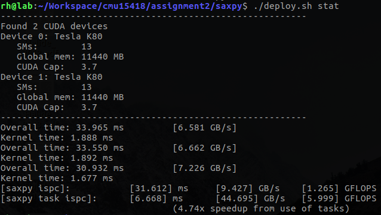
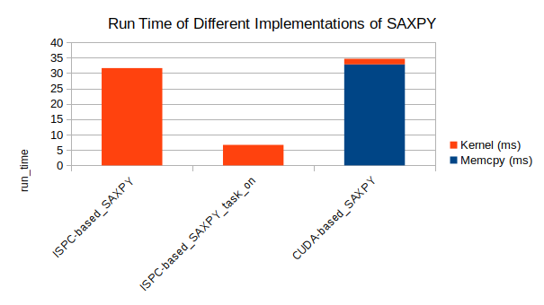

## Program #1 SAXPY

### Solutions

> What performance do you observe compared to the sequential CPU-based implementation of SAXPY (recall program 5 from Assignment 1)? Compare and explain the difference between the results provided by two sets of timers (the timer you added and the timer that was already in the provided starter code). Are the bandwidth values observed roughly consistent with the reported bandwidths available to the different components of the machine? (Hint: You should use the web to track down the memory bandwidth of an NVIDIA GTX 480 GPU, and the maximum transfer speed of the computer's PCIe-x16 bus. It's PCIe 2.0.)

Machine: Intel Xeon CPU E5-2698 x32 with hyper-thread enabled => 64 cores && 128G mem && NVIDIA K80 GPU

由 [K80 board specification](https://images.nvidia.com/content/pdf/kepler/Tesla-K80-BoardSpec-07317-001-v05.pdf) 可知，其 memory 理论带宽上限为 240GB/s（per GPU）。K80 通过 PCIe Gen3x16 和 Host 相连，而 PCIe Gen3x16 理论带宽上限为 32GB/s（双向）。本 case 中 CPU 和 GPU 间传输带宽约为 7GB/s。